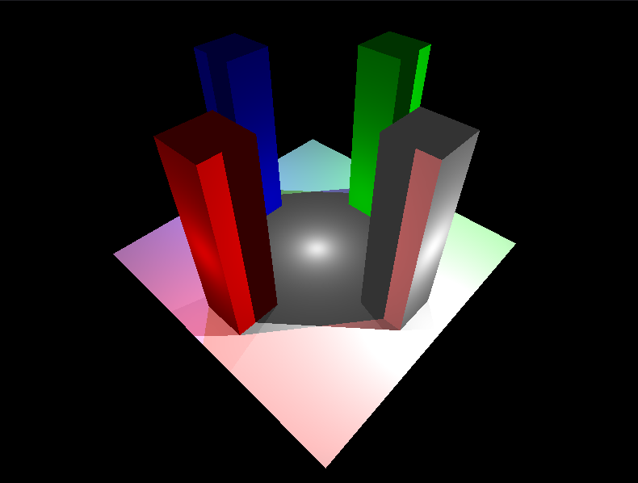

# Implementação do <i>ray-casting</i>

Uma simples implementação do algoritmo <i>ray-casting</i> para renderização de cenas 3D.

---

## O que o código faz
- Renderiza cenas 3D descritas por primitivas triangulares a nível de código.
- As cores de cada pixel são calculadas a partir da interação do raio traçado com a cena.
- São feitos cálculos de interseção dos raios projetados com as primitivas da cena para gerar efeitos de oclusão e sombreamento nas imagens.
- É possível descrever varias luzes cuja iluminação possui as componentes ambiente e difusa, além da atenuação com a distância.
- As cores das luzes interagem entre si e com os objetos.
- O código também permite a leitura e renderização de arquivos .obj.

---

## Imagens do programa


*Exemplo de cena: Cubes*



*Exemplo de cena: Towers*


*Exemplo de cena: Walls*

---

## Compilação e Execução

### Dependências
- C++ 17 (gcc)
- GLUT
- OpenGL

### Compilação
1. Baixe/clone este repositório.
2. No terminal, navegue até a pasta do projeto.
3. Execute:
```bash
make
```
### Execução
```bash
./raycast <cena>
```
Cenas Disponíveis:
  1. obj <arquivo>    - Carrega cena de arquivo OBJ
  2. towers           - Constrói cena com torres
  3. walls            - Constrói cena com paredes
  4. cubes            - Constrói cena com cubos

Exemplo cena:
```bash
./raycast towers
```
Exemplo com obj:
```bash
./raycast obj Deer.obj
```
---

## Principais problemas encontrados
- Tentativa inicial de utilizar funções nativas do OpenGL, porém alterar o pipeline de renderização do OpenGL não é trivial.
- Mesmo paralelizado, a performance é baixa.
- Dificuldades para lidar com o sentido do vetor normal nos cálculos de luz.
- Redimensionamento da janela causa distorções gerais.
- Rotações de câmera inconsistentes com Vup diferente do Y do mundo.

---

## O que pode ser melhorado
- Implementação de estruturas de dados que diminuem as verificações de interseção para acelerar a execução.
- Adição de mais primitivas com suas funções de interseção (linhas, <i>quads</i>, esfera, <i>etc</i>).
- Melhorar a API de descrição de cenas com mais possibilidades de formas.
- Aprimorar o modelo de iluminação adicionando a componente especular.
- Implementação de <i>ray-tracing</i>.

---

## Contribuição da Equipe
O código foi elaborado simultaneamente por todos os membros da equipe, de modo que, um integrante escrevia o código e o resto auxiliava na elaboração e lógica do programa e suas funções.
